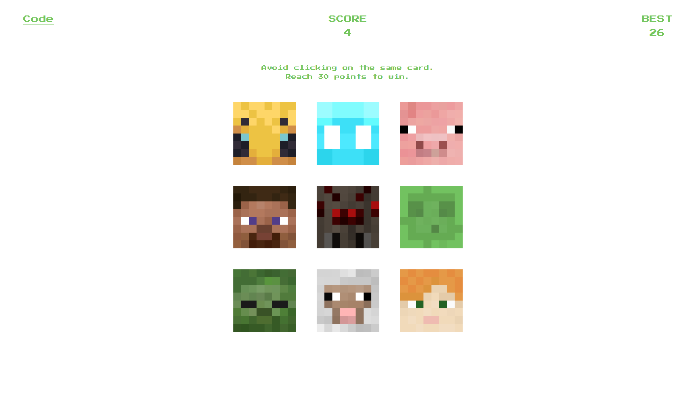

# Memory Card

The Odin Project - React Course Project (2/3):

A memory card game built using React and deployed with Vercel.

## Preview

## Links

Live link: https://memory-card-fawn-five.vercel.app/

Assignment: https://www.theodinproject.com/lessons/node-path-react-new-memory-card

## Credits

Thanks to <a href="https://mc-heads.net">MCHeads</a> for providing Minecraft avatars.
